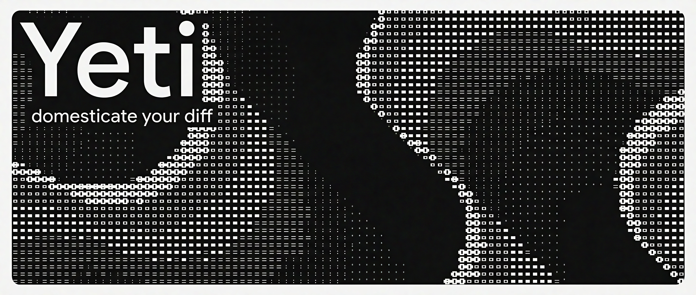

  
  <h2>yeti: domesticate your diff</h2>

A beast that camps between your working directory and Git, sniffing through messy diffs and leaving behind clean, intentional history.

### Your Mess

You panic-stage everything at 2 AM and type "misc fixes". Your future self hates you.

### The Yeti Way

Run `yeti`. It studies your changes, crafts a sharp conventional commit like `feat(home): add homepage layout and routing`, shows you exactly what it thinks happened, and only commits after you nod in approval.

### Claws

| Command | What It Does |
|---------|--------------|
| `yeti` | Single intelligent commit from your current mess |
| `yeti compose` | Split sprawling chaos into logical chunks |
| `yeti branch` | When your changes clearly wandered off the mountain |
| `yeti amend` | Clean up last night's regret |
| `yeti plan` | Preview how your diff should be organized |

### Rules

- No auto-push
- No silent rewrites
- No pretending to be Git
- Just cold, clean history you won't be embarrassed by

